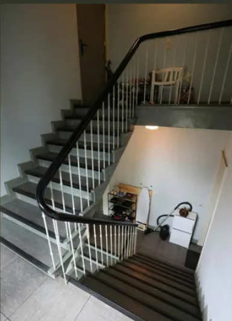

##  Auftrag Detektiv
---

### Fall
- Am Dienstag Morgen verfolgte ein Mann (22) eine Frau (22) von der Ostschweeiz nach Hamburg.
- Lauerte ihr im Treppenhaus auf und erschoss sie
- Laut der Mutter stalkte der Mann die Frau seit neun Monaten.
- Nach der Tat tötete sich der Täter selbst

- --
### Täter

- Kim Wick 
-  22 Jahre alt
- Jungpoltiker
- kommt aus einem Dorf in Thurgau 
- war verliebt in Antonia-Luisa H.
- stalkte Antonia 9 Monate lang
- ging in die Schule mit dem Bruder des Opfers
- lauerte im Treppenhaus auf Antiona.H
- Vor der Bluttat sagte er:"Ich habe noch etwas Wichtiges zu erledigen..."
- hatte kein Rückfahrt-Ticket von Hamburg
- Zimmer im gegenüberliegenden Hotel gemietet mit direktem Blick auf Wohnung
- wird von seinem Umfeld als unauffällig beschrieben
- stzte sich für das duale Bildungssystem und das Klima ein
- Die Präsidentin seiner Bezirkspartei kann die tat nicht fassen
- aktzeptiert kein Nein
- war felsenfest davon überzeugt, dass sie die Frau seines Leben ist
- schickte ihr Libesbriefe, ruf sie an und schickte ihr lange WhatApp Nachrichten
---
### Opfer

- Antonia-Luisa H.
- 22 Jahre alt
- Stundentin
- ist vor rund zweieinhalb Jahren nach Hamburg gezogen, um Musical-Darstellerin
- schickte 30 Minuten bevor sie erschossen wurde das Bild oben an ihre Mutter
- Sie wollte es für die Abschlussprüfung an der Musicalschule verwenden und fragte ihre Mutter um Rat
- wollte ihn Hamburg frei sein
- träumte von einer Karriere als Musical-Darstellerin
- Mutter Elisabeth 62 Jahre alt
- Bruder 24 ging mit Täter zur Schule
- Mutter glaubt das alles von langer Hand geplant war
- merkte schnell, dass mit dem Töter etwas nicht stimmt, da er stets sehr selbstbezogen reagierte
- sagte dem Täter klipp und klar, dass sie nichts von ihm will
- Mutter glaubt, dass der Täter psychische Probleme hatte
- Mutter macht sich vorwürfe, dass sie nicht mit den eltern des Täters gesprochen hat
- Mutter will die Eltern des Täters nach der Tat treffen
- ging mit Kim feiern und wurde seitdem von ihm belagert
- wollte sich von Kim distanzieren
- Ihr Bruder rat stark davon ab, eine Beziehung mit Kim einzugehen
